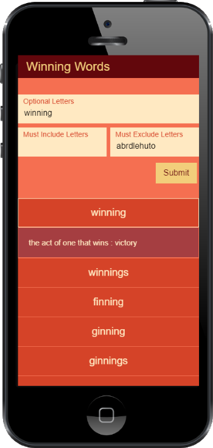

# Winning Words

Winning Words is a word and definition lookup tool for word games like Letterpress. It was built using React and TypeScript with a Node.js/Express server. A JSON word dictionary is included in the project and it uses an Express service to handle requests for word definitions. Try it out at https://winning-words-react.herokuapp.com/



# Project Setup
In the project root run:
```
npm i
npm run build
npm run start
```
## Credit
[Merriam-Webster API](https://dictionaryapi.com/)

[SOWPODS word list](https://raw.githubusercontent.com/jmlewis/valett/master/scrabble/sowpods.txt)
